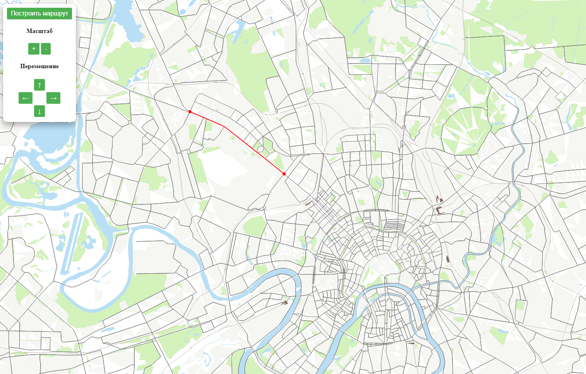

# Карта дорог Москвы

Проект создан в рамках учебной дисциплины "Геоинформационные системы и технологии". Реализована возможность перемещения по карте мышкой, изменение масштаба, построение оптимального маршрута средствами алгоритма A*.

